<!-- ░░░░░░░░░░░░░░░░░░░░░░░░░░░░░░░░░  PRAHARI  ░░░░░░░░░░░░░░░░░░░░░░░░░░░░░░░░░░ -->

<div align="center">

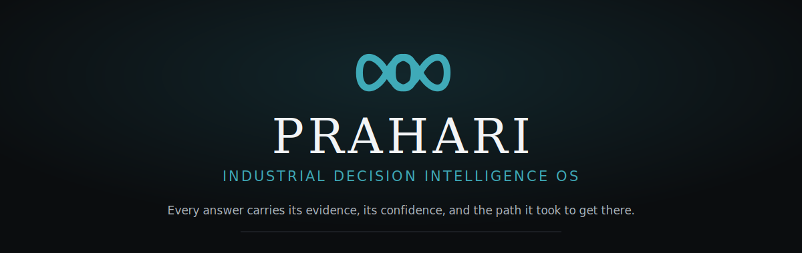

<br/>

**The decision-intelligence layer for industrial plants.**
It reasons across every document — and shows its work.

<br/>

[](LICENSE)
[](codebase/backend/pyproject.toml)
[](codebase/backend)
[](codebase/frontend)
[](codebase/frontend)
[](codebase/backend/tests)
[](#-quick-start)

<br/>

[**Overview**](#-the-problem) · [**Live example**](#-a-single-question-end-to-end) · [**Architecture**](#-architecture) · [**Quick start**](#-quick-start) · [**API**](#-api-surface) · [**Roadmap**](#-roadmap)

</div>

<br/>

> **Prahari is not a chatbot, a GraphRAG demo, or a document search engine.**
> It is an operating system for industrial decision-making. It preserves the *reasoning* behind
> decisions so that no failure repeats because the plant forgot why a decision was made.

<br/>

---

## Table of contents

- [The problem](#-the-problem)
- [The approach](#-the-approach)
- [The three things that make it Prahari](#-the-three-things-that-make-it-prahari)
- [A single question, end to end](#-a-single-question-end-to-end)
- [Interface](#-interface)
- [Architecture](#-architecture)
  - [System at a glance](#system-at-a-glance)
  - [Ports and adapters](#ports-and-adapters)
  - [The ingestion pipeline](#the-ingestion-pipeline)
  - [The investigation pipeline](#the-investigation-pipeline)
  - [The knowledge graph](#the-knowledge-graph)
- [The trust model](#-the-trust-model)
- [Technology](#-technology)
- [Repository structure](#-repository-structure)
- [Quick start](#-quick-start)
- [Configuration](#-configuration)
- [API surface](#-api-surface)
- [Engineering decisions](#-engineering-decisions)
- [Security, scale and enterprise readiness](#-security-scale-and-enterprise-readiness)
- [Testing and quality](#-testing-and-quality)
- [Roadmap](#-roadmap)
- [Contributing](#-contributing)
- [License](#-license)

<br/>

---

## ▸ The problem

Industrial sites run on documents that never talk to each other.

<div align="center">

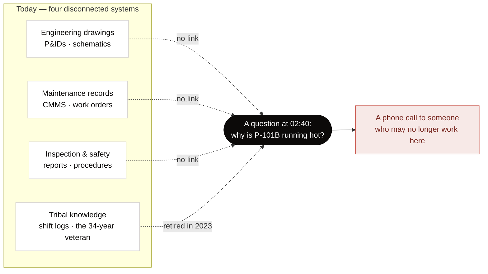

</div>

Engineers spend their time **searching** instead of **solving**, and institutional knowledge
disappears when veterans retire. Traditional keyword search only finds *documents* — it cannot
*connect* them, catch what they contradict, or flag what is missing.

> **The core idea, in one sentence:** *Traditional search finds documents. Prahari builds
> intelligence that connects them, catches what they contradict, flags what's missing, and
> shows its reasoning — the work no single engineer can do across four disconnected systems in
> their head.*

<br/>

---

## ▸ The approach

Prahari turns a scattered corpus into a living intelligence layer, then answers plain-language
questions with **cited, confidence-scored** answers — and refuses, out loud, when it cannot
ground one.

<div align="center">

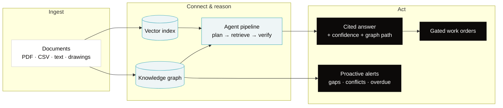

</div>

<br/>

---

## ▸ The three things that make it Prahari

<table>
<tr>
<td width="33%" valign="top">

### ◎ &nbsp;The Living Asset Map

Four identifiers — `P-101B`, "Boiler Feed Pump B", an OEM part number, and "the noisy one" —
collapse into **one canonical asset**. A human confirms the merge; the graph learns; the merge
is **reversible and versioned**.

This human-validated resolution corpus is the moat: it grows every time the tool is merely
*used*, and a competitor cannot copy it.

</td>
<td width="33%" valign="top">

### ❋ &nbsp;Decision Investigation

*"Why is P-101B running hot?"* traverses a causal chain across documents nobody had linked —
vibration alarm → fouled strainer → a 2019 inspection note → a feedstock change — with
**every hop citing a page**, streamed as it is retrieved.

This is reasoning across sources, not retrieval of one. Vector-only search cannot do the
multi-hop.

</td>
<td width="33%" valign="top">

### ⊘ &nbsp;The Refusal

Asked something it cannot ground, Prahari **does not guess**. It states what it could not
ground and **names who to ask**.

In a plant, a wrong answer is worse than no answer. Abstention is a first-class success state —
never styled as an error. Nobody else demos a system that refuses to answer.

</td>
</tr>
</table>

<br/>

---

## ▸ A single question, end to end

The canonical demo. One question exercises ingestion, dual retrieval, multi-hop reasoning, the
trust layer, and the proactive agents at once.

<div align="center">

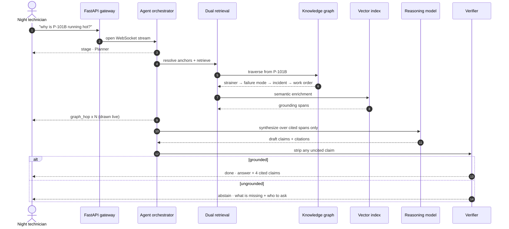

</div>

**What the plant sees:** a grounded hypothesis (restricted suction flow at the drive-end
bearing, traced to fouling on strainer `S-14`), four claims each **Backed by a named document**,
an 11-node traversal drawn hop by hop, an *"also flagged on this equipment"* card surfacing the
overdue OISD inspection — and a one-click *Draft a work order from this hypothesis* that is
gated behind a distinct approver.

<br/>

---

## ▸ Interface

A single-page workspace with a persistent rail — editorial, calm, built entirely from design
tokens. *Placeholders below render immediately and are drop-in replaceable with real captures.*

<div align="center">

|  |  |
|:--:|:--:|
| 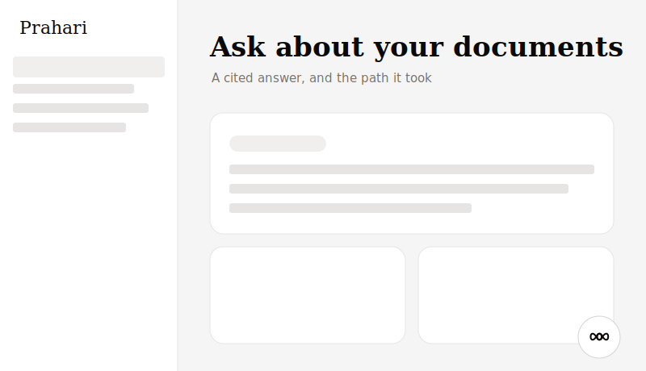 | 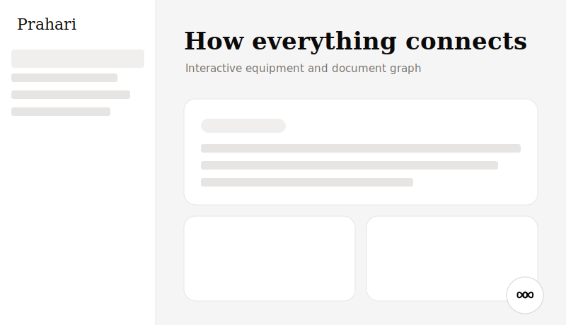 |
| **Ask** — a cited answer, and the path it took | **Knowledge map** — interactive equipment + document graph |
| 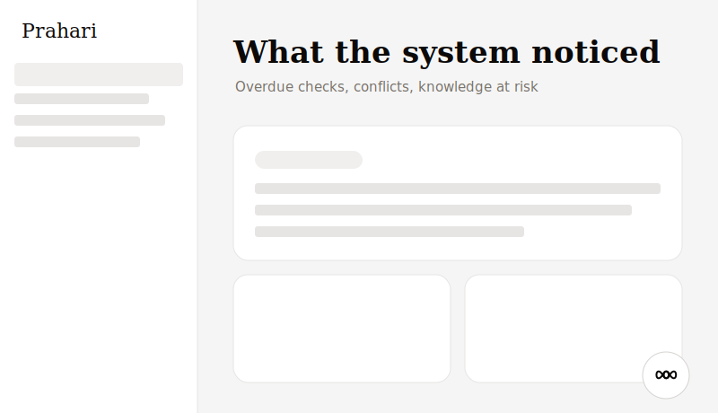 | 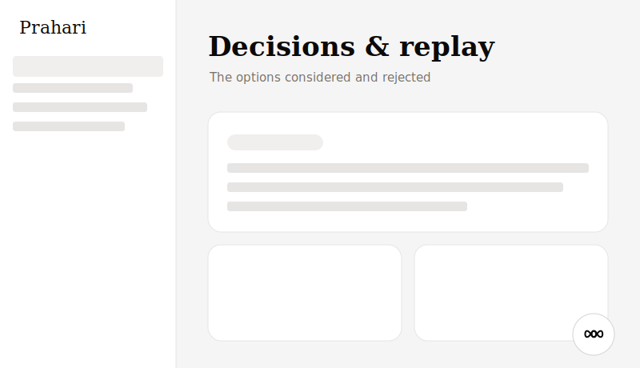 |
| **Alerts** — overdue checks, cross-document conflicts | **Decisions & replay** — the options considered *and rejected* |
| 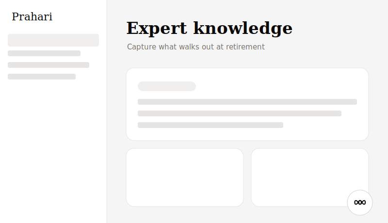 | 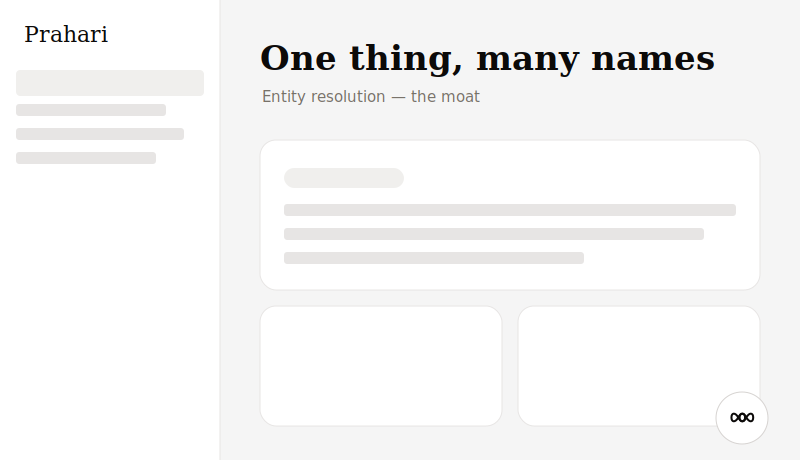 |
| **Expert knowledge** — capture what walks out at retirement | **Asset map** — entity resolution, the moat |

</div>

<br/>

---

## ▸ Architecture

### System at a glance

A **hexagonal (ports/adapters) modular monolith**. Every capability depends on an interface,
never a concrete store — so the same code runs air-gapped on SQLite or scaled on
Neo4j/Qdrant/Postgres, chosen by one setting.

<div align="center">

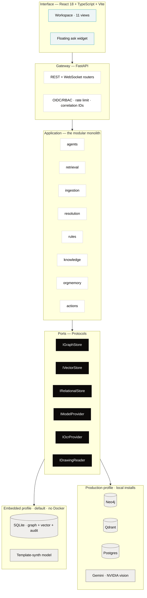

</div>

### Ports and adapters

Six ports, two adapter families. The embedded family is the supported local runtime and the
CP-9 air-gap fallback — **not a mock**.

| Port | What it abstracts | Embedded adapter (default) | Production adapter |
|---|---|---|---|
| `IGraphStore` | Bitemporal knowledge graph | SQLite | Neo4j |
| `IVectorStore` | Semantic span search | Local hashing embedder + cosine | Qdrant |
| `IRelationalStore` | Metadata + append-only audit | SQLite | Postgres |
| `IModelProvider` | Reasoning model (CP-5) | Template-synth (`-model` rung) | Google Gemini · local open-weights |
| `IOcrProvider` | Text from scanned pages | `none` → quarantine honestly | NVIDIA vision · Unlimited-OCR · PaddleOCR |
| `IDrawingReader` | **Reasoning over drawings** | `none` → quarantine honestly | NVIDIA vision (P&ID → graph edges) |

### The ingestion pipeline

Every fact is stamped with its provenance **before** it can enter the graph. A document the
system cannot read confidently is **quarantined with a stated reason**, never guessed at.

<div align="center">

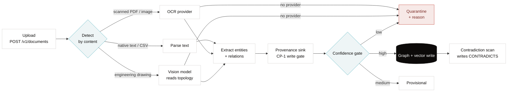

</div>

> **The drawings path is the differentiator.** A vision model turns a P&ID into graph edges —
> `S-14 CONNECTED_TO P-101B` — which is exactly what makes *"what's upstream of P-101B?"*
> answerable, and what keyword search can never do. Both OCR and the VLM default to `none`, so a
> fresh checkout boots free and GPU-less, quarantining what it cannot read rather than faking it.

### The investigation pipeline

A bounded five-stage agent loop, streamed over a WebSocket. The Verifier is the contract: it
strips any claim that does not map to a retrieved span, and abstains below the grounding
threshold.

<div align="center">

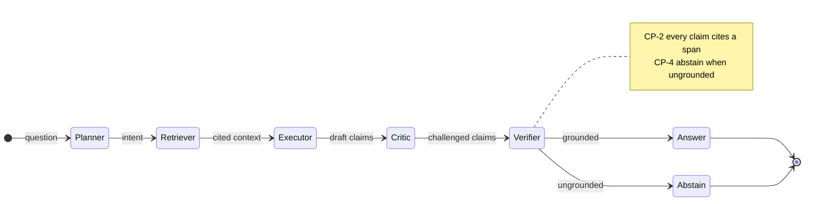

</div>

**Streamed events** consumed by the console:
`banner` · `stage` · `graph_hop` · `token` · `claim` · `verdict` · `abstain` · `done` · `error`.

### The knowledge graph

An ontology-backed graph (ISO 14224 / DEXPI aligned). A fact-bearing node or edge cannot be
written without a source span — the CP-1 gate is enforced, not advisory.

<div align="center">

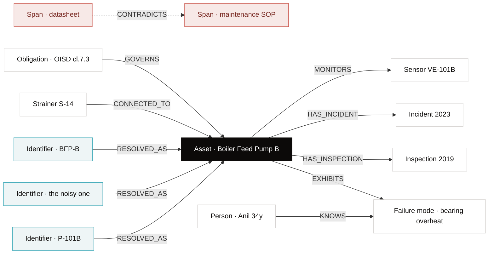

</div>

<br/>

---

## ▸ The trust model

Prahari is engineered so a wrong answer is architecturally hard to produce. Four invariants,
enforced in code.

| Invariant | Guarantee | Mechanism |
|---|---|---|
| **CP-1 Provenance** | No fact enters the graph without a source | `graph/provenance_sink.py` rejects unsourced writes |
| **CP-2 Citation** | Every AI claim resolves to `doc · page · span` | Verifier strips uncited claims; providers cite only given spans |
| **CP-4 Abstention** | It refuses rather than guesses | `Verdict.ABSTAINED` with `{known, unresolved, who_to_ask}` |
| **CP-9 Degradation** | Reduced capability is surfaced, never hidden | `resilience/` ladder → honest UI banner |

Plus: **never imply completeness** — compliance surfaces carry a permanent, non-collapsible
coverage footer stating how many clauses are actually encoded; **append-only audit** — the
audit surface exposes no edit or delete affordance anywhere; **gated writes (CP-3)** — the
person who drafts a work order cannot be the person who approves it.

<br/>

---

## ▸ Technology

<div align="center">


<br/>


</div>

| Layer | Choice | Why |
|---|---|---|
| Backend | FastAPI (Python 3.12), hexagonal monolith | One process, async streaming, clean ports/adapters seam |
| Reasoning model | Google Gemini (Flash-Lite) primary, local open-weights, template-synth | Low-cost default; grounded structured fallback with **no key** |
| Drawings | NVIDIA hosted vision (P&ID → topology) | Turns a diagram into graph edges, not transcribed text |
| OCR | NVIDIA vision · Unlimited-OCR · PaddleOCR | Pluggable; defaults to `none` and quarantines honestly |
| Graph | SQLite (embedded) → Neo4j (production) | Same port; air-gap by default, scale by config |
| Vector | Local hashing embedder → Qdrant | Offline-first; no external service required to run |
| Frontend | React 18 + TypeScript + Vite | Token-driven editorial design system, no UI framework |
| Auth | Dev JWT stub → OIDC (RS256/JWKS) | RBAC matrix + deny-by-default ABAC in both profiles |

<br/>

---

## ▸ Repository structure

```
Prahari/
├─ 00_IMPLEMENTATION_RULES.md          # governance — the authority order
├─ 01_PROJECT_CONTEXT.md               # problem statement & vision
├─ 02_..._Product_Requirements_Bible.md# the source of truth
├─ 03_design.md                        # design system (UI authority)
├─ 04_demo.md                          # demo & presentation flow
├─ references/                         # engineering volumes (02 … 15)
├─ docs/                               # ADRs, API, diagrams, status
│
├─ codebase/
│  ├─ backend/                         # FastAPI modular monolith
│  │  ├─ app/
│  │  │  ├─ config.py · container.py   # settings · composition root
│  │  │  ├─ ports/                     # IGraphStore · IVector · IModel · IOcr · IDrawing
│  │  │  ├─ stores/                    # embedded (SQLite) · production adapters
│  │  │  ├─ domain/                    # models · graph ontology · errors
│  │  │  ├─ ingestion/                 # pipeline · extractors · ocr · drawings
│  │  │  ├─ agents/                    # orchestrator · providers · model router
│  │  │  ├─ retrieval/                 # dual graph + vector router
│  │  │  ├─ resolution/                # entity resolution (the moat)
│  │  │  ├─ knowledge/                 # decay · contradiction detection
│  │  │  ├─ rules/ · orgmemory/        # compliance · expert capture
│  │  │  ├─ actions/ · corrections/    # gated writes · learning loop
│  │  │  ├─ resilience/ · auth/        # CP-9 ladder · OIDC/RBAC/ABAC
│  │  │  └─ api/                       # REST + WebSocket routers
│  │  ├─ prompts/                      # versioned prompts + manifest
│  │  ├─ data/corpus/                  # the demo corpus + P&ID drawing
│  │  └─ tests/                        # 29 critical-path tests
│  │
│  ├─ frontend/                        # React + TS PWA console
│  │  └─ src/
│  │     ├─ views/                     # Ask · Alerts · Map · Decisions · Expert …
│  │     ├─ components/                # AnswerCard · NetworkGraph · ChatWidget …
│  │     ├─ lib/                       # api · session · investigation · graph
│  │     └─ design/                    # tokens.css · global.css
│  │
│  └─ eval/                            # golden-set evaluation harness
└─ assets/readme/                      # brand assets for this page
```

<details>
<summary><b>Backend module ledger</b> (click to expand)</summary>

<br/>

| Module | Owns |
|---|---|
| `ingestion` | Upload → detect → OCR/VLM → extract → provenance → confidence gate → write |
| `agents` | Planner→Retriever→Executor→Critic→Verifier orchestration + providers |
| `retrieval` | Dual graph-traversal + vector-enrichment context assembly |
| `resolution` | Identifier→Asset entity resolution, reversible merges (the moat) |
| `knowledge` | Staleness/decay flags **and** cross-document contradiction detection |
| `rules` | Compliance obligations + honest encoded-vs-total coverage |
| `orgmemory` | Expert knowledge capture — stored as citable spans |
| `decisions` | Decision memory + full reasoning replay |
| `actions` | Work-order draft/approve, two-person gate (CP-3) |
| `resilience` | CP-9 degradation ladder, circuit breaker, rate limit |
| `auth` | Dev/OIDC identity, RBAC matrix, ABAC policy |
| `graph` | The CP-1 provenance write gate |
| `stores` | Embedded (SQLite) + production (Neo4j/Qdrant/Postgres) adapters |

</details>

<br/>

---

## ▸ Quick start

**No Docker. No external services. No API key.** The default profile runs on one box.

```bash
# 1 — backend (embedded profile)
cd codebase/backend
py -3.12 -m venv .venv && .venv\Scripts\activate      # Windows
pip install -e ".[dev]"
python -m app.seed                                     # seed the demo corpus
uvicorn app.main:app --port 8000                       # http://localhost:8000/docs
```

```bash
# 2 — frontend (in a second terminal)
cd codebase/frontend
npm install
npm run dev                                            # http://localhost:5174
```

Open the console, ask **"why is P-101B running hot?"**, and watch the traversal draw itself.

<details>
<summary><b>Verify the install</b></summary>

<br/>

```bash
cd codebase/backend
pytest -q                       # 29 passing — critical-path + drawings + contradictions
cd ../frontend
npx tsc --noEmit                # strict typecheck, clean
npm run build                   # production build, clean
```

</details>

<details>
<summary><b>Production profile — still no Docker</b></summary>

<br/>

Set `PRAHARI_PROFILE=production` and point at local installs of Neo4j, Qdrant and Postgres:

```bash
pip install -e ".[production]"
# PRAHARI_GRAPH_URI=bolt://localhost:7687
# PRAHARI_VECTOR_URL=http://localhost:6333
# PRAHARI_PG_DSN=postgresql://...
```

The port contract is identical, so no application code changes.

</details>

<br/>

---

## ▸ Configuration

Every setting is read from the environment with a `PRAHARI_` prefix. The app boots with **none
of them set**. See [`codebase/backend/.env.example`](codebase/backend/.env.example).

| Variable | Purpose | Default |
|---|---|---|
| `PRAHARI_PROFILE` | `embedded` (SQLite, no services) or `production` | `embedded` |
| `PRAHARI_GEMINI_API_KEY` | Enables narrated answers (Full rung) | *(unset → structured rung)* |
| `PRAHARI_VLM_PROVIDER` | Drawings reasoning — `cosmos` / `openai_vision` / `none` | `none` |
| `PRAHARI_NVIDIA_API_KEY` | Key for hosted vision (drawings + OCR) | *(unset)* |
| `PRAHARI_OCR_PROVIDER` | Scanned-page OCR — `unlimited` / `paddle` / `none` | `none` |
| `PRAHARI_FORCE_RUNG` | Demo the CP-9 degradation ladder | *(unset)* |
| `PRAHARI_OIDC_JWKS_URI` | Federate to a real IdP (RS256) | *(dev stub)* |

<br/>

---

## ▸ API surface

**34 REST endpoints + one WebSocket stream.** Live OpenAPI at `/docs`.

<details>
<summary><b>Endpoint reference</b> (click to expand)</summary>

<br/>

| Area | Endpoints |
|---|---|
| **Investigate** | `POST /v1/investigations` · `GET /v1/investigations[/{id}]` · `WS /v1/stream/investigations/{id}` |
| **Documents** | `POST /v1/documents` · `GET /v1/documents/{id}` · `GET /v1/ingestion[/{job}]` |
| **Assets & resolution** | `GET /v1/assets` · `GET /v1/resolution/queue` · `POST /v1/resolution/{id}/adjudicate` · `POST /v1/resolution/unmerge/{id}` |
| **Compliance** | `GET /v1/compliance/assets/{id}` · `GET /v1/compliance/coverage` |
| **Knowledge** | `GET /v1/knowledge/health` · `POST /v1/knowledge/run-decay` · `.../flags/{id}/reverify` · `.../supersede` |
| **Memory** | `GET /v1/org-memory` · `POST /v1/org-memory/{person\|knows}` |
| **Decisions** | `GET /v1/decisions` · `GET /v1/decisions/{id}/replay` |
| **Actions** | `GET /v1/actions` · `POST /v1/actions/work-order/{draft\|submit\|reject}` |
| **Corrections** | `POST /v1/corrections` · `GET /v1/corrections` |
| **Ops** | `GET /v1/health` · `GET /v1/audit` · `GET /v1/analytics` · `POST /v1/admin/degrade` |
| **Auth** | `POST /v1/auth/login` · `GET /v1/auth/me` |

</details>

```bash
# Ask a question (returns an investigation id; open the WS to stream it)
curl -X POST http://localhost:8000/v1/investigations \
  -H "Authorization: Bearer <token>" -H "Content-Type: application/json" \
  -d '{"question":"why is P-101B running hot?"}'
```

<br/>

---

## ▸ Engineering decisions

| # | Decision | Rationale |
|---|---|---|
| ADR-006 | **Modular monolith**, not microservices | One deployable, clean seams; extract later if needed |
| ADR-P01 | **Two adapter families** behind one set of ports | Air-gap on SQLite *or* scale on Neo4j/Qdrant, by config |
| ADR-P02 | **Provider-abstracted model** with a CP-9 ladder | Runs grounded and cited with no key; degrades honestly |
| CP-1 | **Provenance write gate** | A fact without a source is a defect, not a shortcut |
| ADR-012 | **Provenance-clean seed corpus** | Every demo fact is traceable to a real span |

Full records in [`docs/ADR/architecture_decisions.md`](docs/ADR/architecture_decisions.md) and
the [`references/`](references) volumes.

<br/>

---

## ▸ Security, scale and enterprise readiness

- **Identity** — dev JWT stub for demos; OIDC (RS256 + JWKS, audience/issuer/expiry) for
  production. Deny-by-default ABAC runs in both profiles.
- **Authorization** — a module × role RBAC matrix; capabilities a user cannot access are
  hidden entirely, not greyed out.
- **Audit** — append-only by construction; no update or delete path on audit entries.
- **Air-gap** — the embedded profile has no answer-path egress. Local model, local embeddings,
  local graph. The fallback and the air-gap are the same design.
- **Scale** — stateless API; graph, vector and relational stores scale independently under the
  production profile; the port contract stays identical.
- **Prompt-injection posture** — ingested document text is treated strictly as data, never as
  instruction.

<br/>

---

## ▸ Testing and quality

```
pytest -q   →   29 passed
```

The suite is release-gate shaped: the critical path (ingest → resolve → investigate →
abstain), the drawings-to-graph path, and cross-document contradiction detection. The frontend
is `tsc --noEmit` strict and builds clean.

| Signal | Status |
|---|---|
| Backend tests |  |
| Frontend typecheck |  |
| Runtime dependencies to start |  |

<br/>

---

## ▸ Roadmap

<div align="center">

```mermaid
flowchart LR
  subgraph S["Shipped"]
    direction TB
    S1["Dual retrieval + cited answers"]
    S2["Entity resolution moat"]
    S3["Drawings to graph via VLM"]
    S4["Contradiction detection"]
    S5["Decision replay"]
    S6["Expert-knowledge capture"]
  end
  subgraph N["Near term"]
    direction TB
    N1["Hybrid rerank + BM25 fusion"]
    N2["Auto ingestion to resolution"]
    N3["Two-person-rule enforcement"]
  end
  subgraph E["Exploring"]
    direction TB
    E1["PID topology at scale"]
    E2["Predictive maintenance agent"]
    E3["Multi-site federation"]
  end
  S --> N --> E

  classDef done fill:#0c0a09,stroke:#0c0a09,color:#ffffff;
  classDef near fill:#eef5f6,stroke:#3FAAB8,color:#0c0a09;
  classDef expl fill:#ffffff,stroke:#d6d3d1,color:#0c0a09;
  class S1,S2,S3,S4,S5,S6 done;
  class N1,N2,N3 near;
  class E1,E2,E3 expl;
```

</div>

<br/>

---

## ▸ Contributing

The build follows a strict authority order — the Product Requirements Bible, then `03_design.md`
for UI, then the `references/` volumes. Before a change: read
[`00_IMPLEMENTATION_RULES.md`](00_IMPLEMENTATION_RULES.md). Conform to the existing
ports/adapters and design tokens; never introduce a raw hex or a parallel structure.

<br/>

---

## ▸ License

Released under the [MIT License](LICENSE).

<br/>

<div align="center">


</div>
