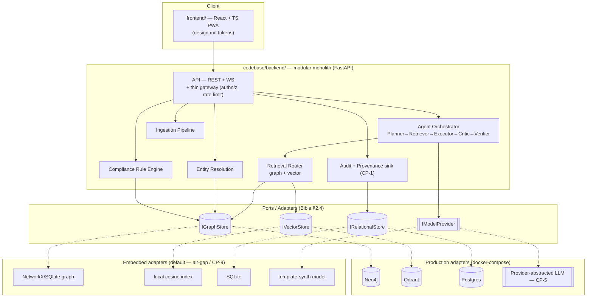
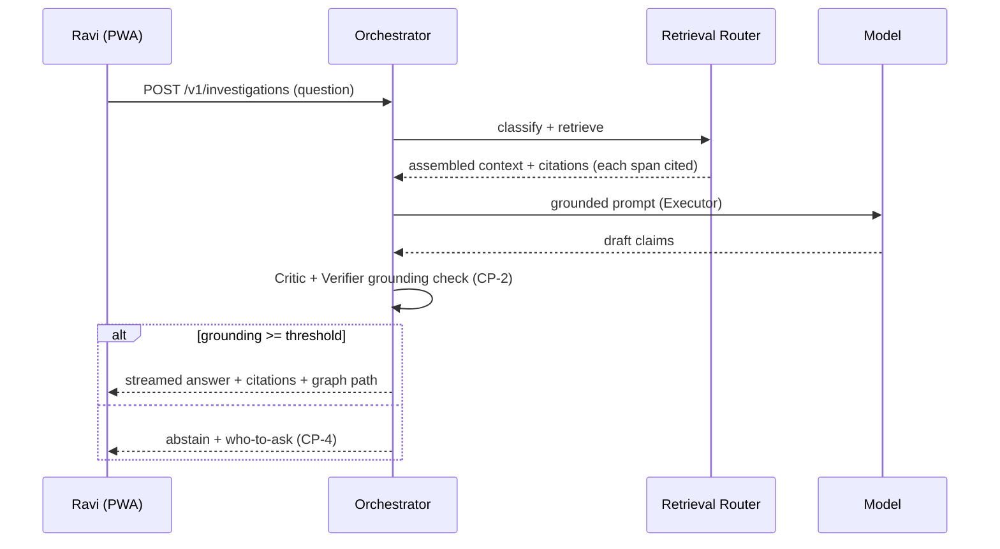
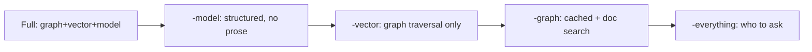

# Architecture Diagrams

C4-style views of the as-built system (Bible §2). Diagrams are Mermaid so they are diffable.

## Containers (as built)

## Investigation sequence (M1)

## The CP-9 degradation ladder (Bible §2.8)

