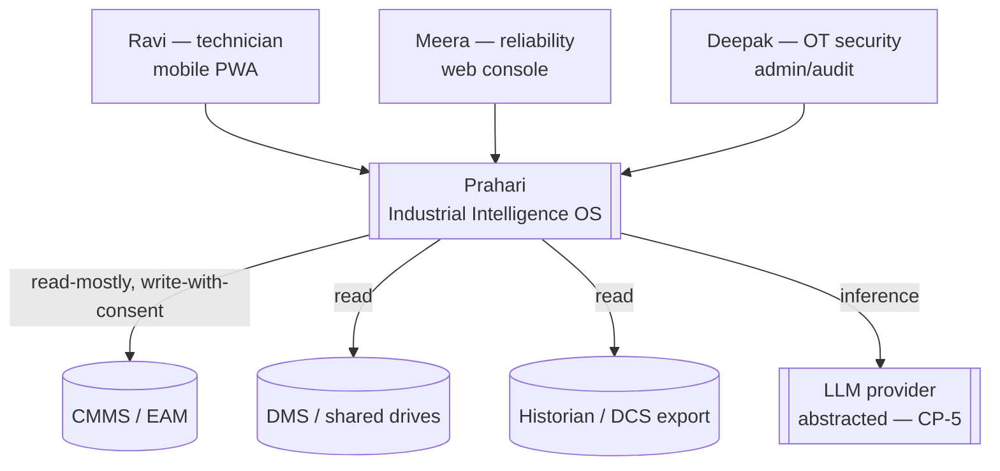
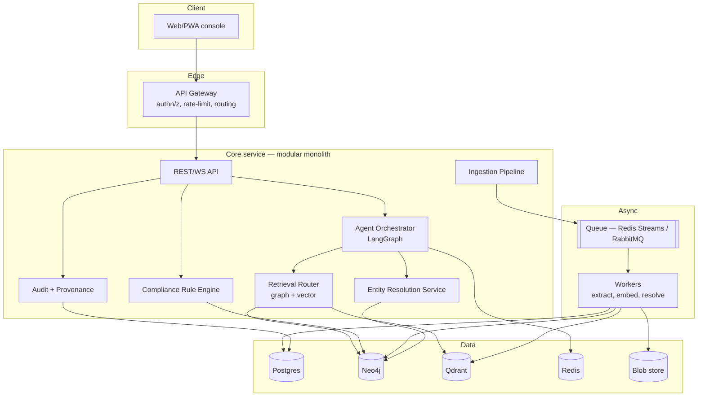
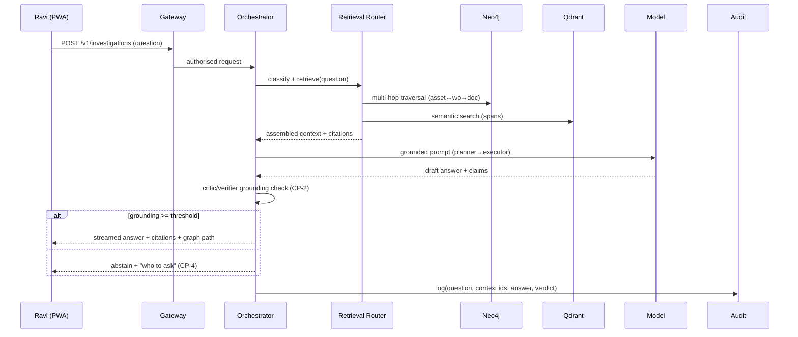

# 02 — System Architecture

> C4 model, boundaries, resilience, and the async/streaming backbone. Diagrams are ASCII/Mermaid so they are diffable and buildable.

## 2.1 Architecture style — decision

**Modular monolith for the hackathon; extract to services along seams for enterprise.** `[D]`

- **Why:** a 4-person team in 4 days cannot operate a microservice mesh; premature services multiply failure surface and demo fragility. A modular monolith with clean internal boundaries (ports/adapters) gives us the *option* to extract later without paying the distributed-systems tax now.
- **Why not microservices now:** network hops, distributed tracing, and inter-service auth are pure cost before product-market fit.
- **Why not a big ball of mud:** the boundaries below are enforced as package boundaries and are the exact seams for future extraction.
- **Debt:** the ingestion pipeline and the model-inference workers want to be separate deployables at scale; recorded in ADR-007 and `17_ROADMAP.md`.

## 2.2 C4 — Level 1: System Context



**Trust boundary:** everything inside `Prahari` runs in-boundary (customer VPC or air-gap). The only egress is model inference, which is provider-abstracted and, in air-gapped mode, served by a local model (CP-9 fallback).

## 2.3 C4 — Level 2: Containers



## 2.4 C4 — Level 3: Component (Core service)

| Component | Responsibility | Key ports (interfaces) |
|---|---|---|
| **API** | HTTP/WS surface, DTO validation, streaming | `IQueryService`, `IIngestService` |
| **Agent Orchestrator** | Planner→Executor→Critic→Verifier graph; tool calls | `IAgentRuntime`, `IToolRegistry` |
| **Retrieval Router** | Classify query → graph / vector / hybrid; assemble context | `IRetriever` |
| **Ingestion Pipeline** | Parse→OCR→layout→extract entities/relations→provenance | `IExtractor`, `IProvenanceSink` |
| **Entity Resolution** | Candidate generation, scoring, human adjudication, merge/reverse | `IResolver` |
| **Compliance Rule Engine** | Evaluate versioned rules vs graph state → evidence/gaps | `IRuleEngine` |
| **Audit + Provenance** | Append-only log of reads/writes/answers | `IAuditSink` |

Each port has exactly one adapter today (in-process) and is the extraction seam for a future service.

## 2.5 Data flow — investigation (sequence)



## 2.6 Data flow — ingestion (sequence)

```
upload → blob store → enqueue(doc_id)
worker: detect type → parse (Docling) → OCR (PaddleOCR) if scan
      → layout/graphics (YOLO/Relationformer for P&ID) → extract entities+relations
      → provenance stamp {doc,page,span,method,confidence}
      → entity-resolution candidates → (auto-merge high conf | queue for human)
      → write nodes/edges (Neo4j) + embeddings (Qdrant) + metadata (Postgres)
      → emit ingestion_complete event
```

## 2.7 Cross-cutting resilience patterns

| Concern | Mechanism |
|---|---|
| **Retry** | Idempotent workers; exponential backoff with jitter on transient failures |
| **Dead-letter** | Poison messages → DLQ after N attempts; surfaced in ops dashboard |
| **Circuit breaker** | Model/provider calls wrapped; open circuit → local fallback (CP-9) |
| **Rate limiting** | Token bucket per tenant + per user at the gateway |
| **Backpressure** | Bounded queues; ingestion sheds load before core degrades |
| **Caching** | Redis: semantic cache (query→answer), graph-fetch cache, embedding cache |
| **Bulkhead** | Ingestion workers isolated from query path resources |

## 2.8 Degradation ladder (CP-9) — the reason the demo cannot fail

```
Full:        graph + vector + model → grounded cited answer
-model:      graph + vector, template synthesis → structured answer, no prose
-vector:     graph traversal only → path + linked docs, no semantic recall
-graph:      cached answers + document search → "here is what I can see"
-everything: "who to ask" from the org-memory graph (last-known experts)
```
Each rung is a *product state*, styled and labelled, never a blank screen or spinner-of-death.

## 2.9 API Gateway responsibilities

Authentication (OIDC token validation), authorisation (coarse RBAC pre-check), rate limiting, request routing, request/response logging correlation IDs, WebSocket upgrade for streaming, and payload size limits. It performs **no business logic** — a thin, replaceable edge.

## 2.10 Scalability & latency notes

- Read path (queries) scales horizontally behind the gateway; stateless core replicas share Neo4j/Qdrant/Redis.
- Write path (ingestion) scales by adding workers; queue absorbs bursts.
- Neo4j read replicas for traversal-heavy load; Qdrant sharded by tenant at enterprise scale.
- Latency budget (NFR-1): classify 150ms + retrieve 1.5s + generate (streamed) + verify 400ms; first token ≤ 2s.

---

**Red Devil:** *Fowler:* "Modular-monolith-with-seams is the honest choice; the ports are real extraction points. **APPROVED.**" *Kleppmann:* "Bitemporal graph + DLQ + idempotent workers is the correct data-intensive posture."
**Hackathon Winning:** "The degradation ladder is itself a demo asset — show the graph turned off and the system still behaving. **Strong Winner.**"
**Black Swan:** "Model commoditisation is *positive* here — CP-5 keeps the substrate. **Survivable.**"
**Green:** avoided downtime dominates inference footprint `[D]`. **Positive.**
